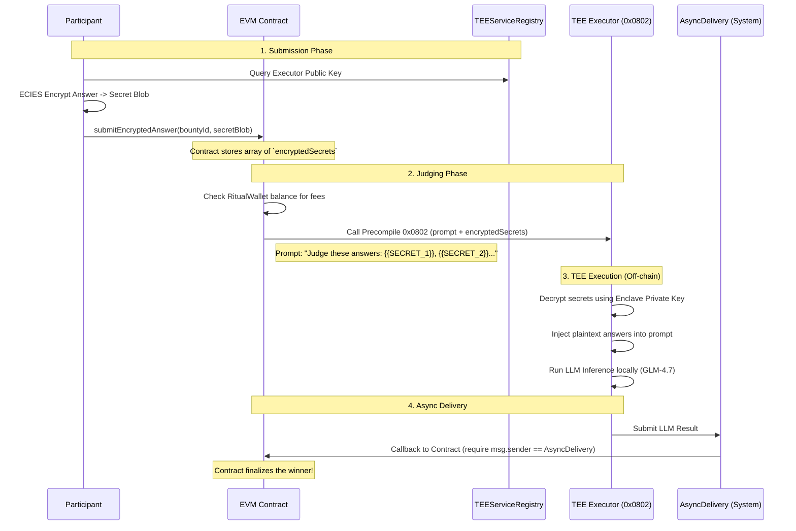

# Privacy-Preserving AI Bounty Judge

This repository contains the solution for the "Privacy-Preserving AI Bounty Judge" workshop homework.

## 1. New Bounty Lifecycle (Commit-Reveal Flow)

The `AIBountyJudge.sol` smart contract implements a commit-reveal flow to ensure that submissions remain hidden from other participants until the submission phase ends, preventing "answer copying" or front-running.

**The lifecycle steps:**
1. **Creation**: The bounty owner creates a new bounty by calling `createBounty(submissionDuration, revealDuration)`. The smart contract tracks the `submissionDeadline` and `revealDeadline`.
2. **Submission Phase**: Participants calculate a commitment hash off-chain using the formula: `keccak256(abi.encodePacked(answer, salt, msg.sender, bountyId))`. They submit *only* this `bytes32 commitment` via the `submitCommitment` function. No plaintext answer is exposed.
3. **Reveal Phase**: Once the submission deadline passes, participants call `revealAnswer` to reveal their `answer` and `salt`. The contract verifies the hash. Valid answers are marked as eligible.
4. **Judging**: After the reveal deadline passes, the owner calls `judgeAll()`. All valid, revealed answers are available off-chain via the helper `getRevealedSubmissions()`, which the Ritual node reads and sends to the LLM for judging.
5. **Finalization**: The LLM outputs the best answer, and the owner finalizes the winner using `finalizeWinner()`, dispensing the reward.

---

## 2. Architecture Note: Commit-Reveal vs. Ritual-Native Hidden Submissions

### Commit-Reveal (Required Track)
- **Strengths**: Fully decentralized and relies entirely on standard EVM primitives. It works on any EVM-compatible chain out of the box without requiring specialized infrastructure.
- **Weaknesses**: The biggest flaw is that the answers *must be revealed in plaintext* before the judging happens. This means the answers are public when the LLM is judging, allowing observers to see the answers before a winner is chosen.

### Ritual-Native Encrypted Submissions (Advanced Track)
- **Strengths**: Submissions are never exposed on-chain in plaintext. The evaluation happens inside a TEE, making the process completely private until the very end.
- **Weaknesses**: Relies heavily on the security and availability of the Ritual TEE and off-chain execution infrastructure. 

---

## 3. Advanced Track: Ritual-Native Hidden Submissions Design

Instead of using a generic commit-reveal scheme, we can leverage Ritual's **System Contracts** and **LLM Inference Precompile (`0x0802`)** so that answers stay completely hidden forever, even during the judging phase.

### Architecture: ECIES Encrypted Secrets & LLM Precompile

According to the [Ritual System Contracts Documentation](https://docs.ritualfoundation.org/#system-contracts), Ritual supports `encryptedSecrets` for precompiles. This allows users to pass encrypted data to the TEE, which injects the decrypted data directly into the LLM prompt inside the secure enclave.

### Key Components Used
- **`encryptedSecrets` (ECIES)**: Participants encrypt their submissions off-chain. The plaintext answer is never exposed on-chain or in the mempool.
- **`TEEServiceRegistry` (`0x9644e8...`)**: Used by frontends to find the active TEE Executor's public key for encryption.
- **LLM Inference Precompile (`0x0802`)**: The smart contract passes the templated prompt and the array of `encryptedSecrets`. The TEE decrypts them dynamically.
- **`AsyncDelivery` (`0x5A1621...`)**: The system contract that safely delivers the final LLM judgement back to our contract. We verify `msg.sender == ASYNC_DELIVERY_ADDRESS` to prevent spoofing.
- **`RitualWallet` (`0x532F0d...`)**: The contract must have sufficient prepaid balance in the RitualWallet before calling the async LLM precompile.

By utilizing this architecture, the bounty system achieves true privacy without needing an awkward "reveal" phase where answers can be stolen.
